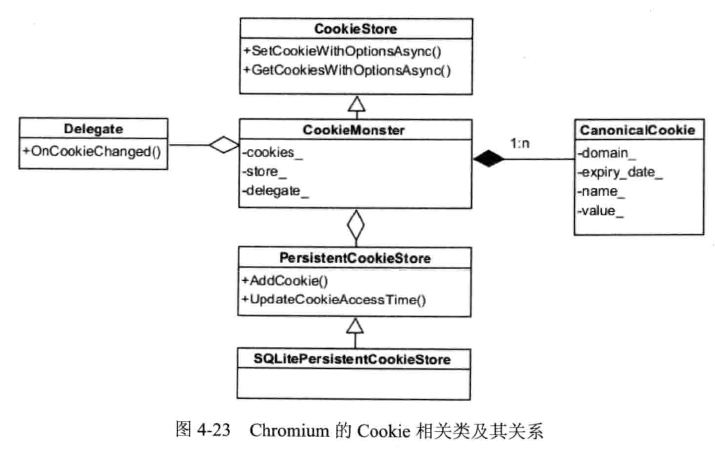
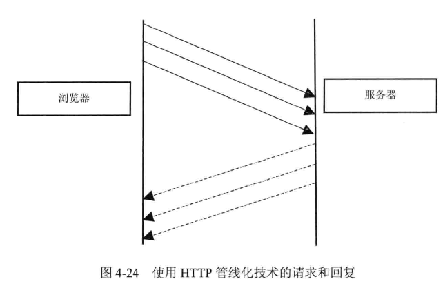
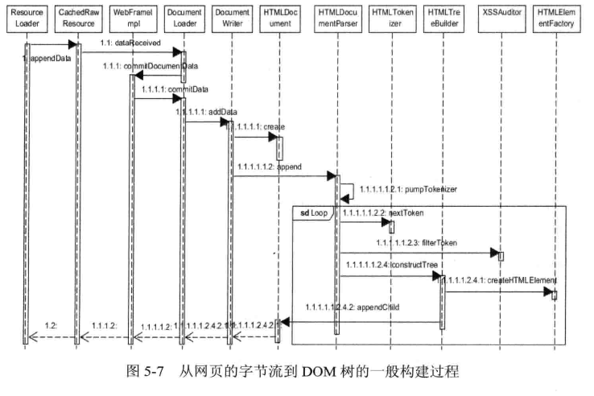

# web_kernel_learning_note
web_kernel_learning_note

web内核学习笔记《webkit技术内幕》

### 第一章 浏览器和浏览器内核

- chromium本身也是一个浏览器，是基于webkit内核演进出来的。chrome是chromium开源的稳定版本。
- 浏览器的功能包括网络、资源管理、网页浏览、多页面管理、插件和扩展、书签管理、历史记录管理、设置管理、下载管理、账户和同步、安全机制、隐私管理、外观主题、开发者工具
- HTML5包含了一系列的标准，包含了10个大的类别：离线（offline）、存储（storage）、连接（connectivity）、文件访问（file access）、语义（semantics）、音频和视频（audio/video)、3D和图形（3D/graphics)、展示（presentation）、性能（performance）和其他
- User Agent用来表明浏览器的身份，可以让web服务器知道当前浏览器的类型，从而为不同的浏览器发送不同的内容，例如Chrome桌面版和Android版发送不同的内容以适应屏幕和操作系统。
- 当某一个浏览器成为主流时（例如chrome），内容服务商会单独给这个浏览器提供额外内容，其他浏览器就会把自己的user Agent修改成chrome的，蹭chrome的额外内容。
- 早期的web内核包括HTML解析器、CSS解释器、布局layout、JavaScript引擎为主的渲染引擎，还包括网络、存储、2D/3D图形、音频和视频、图片解码器等，如下图所示：

- 早期webkit的渲染流程如下图所示

- 后来苹果宣布了WebKit2，目标是抽象出一组新的接口，使调用者代码和网页的渲染代码分成了两个进程。同时接口的使用者不需要理解背后的多进程机制，这时候webkit变成了如下的架构：

  

  ### 第二章  HTML网页和结构

1. 每一个网页都是由HTML、CSS和Javascript组成的，CSS用来将样式和数据分离，Javascript用来处理和用户交互

2. HTML5标准发布以后，浏览器将原生支持多媒体、2D/3D图形，不需要借助第三方插件，这些和其他普通HTML元素一样，可以赋予同样的样式和操作，支持Javascript的各种变换。

3. 对于需要复杂变换和处理的元素，他们需要新层，为了渲染引擎在处理上的方便和高效，这些新层通常以frameset、frame、iframe为框结构。或者是div、video等标签。

4. 浏览器的主要作用是将用户的url转变成可视化图像，其中包含两个过程，一个是网页加载过程，从url到构建dom树，第二是网页渲染过程，从dom树到生成可视化图像

5. 通常网页要比我们的屏幕可视面积要大（要滚动下去），当前可见的区域称为视图（viewport）

6. 根据数据的流向， 渲染过程分为三个阶段：（1）从网页的URL到构建完DOM树（2）从DOM树到构建完webkit的绘图上下文（3）从绘图上下文到生成最终的图像。

   1. 当用户输入网页URL的时候，Webkit调用其资源加载器加载该URL对应的网页

   2. 加载器依赖网络模块建立连接，发送请求并接受答复

   3. webkit接受到各种网页和资源的数据

   4. 收到网页的数据，交给HTML解释器转变成一系列的词法（Token）

   5. 解释器根据词法构建节点（Node），形成DOM树

   6. 如果是JavaScript代码的话，调用JavaScript引擎解释并执行。

   7. JavaScript代码会修改DOM树的结构

   8. 如果节点需要依赖其他资源如图片等，如果是异步的无所谓，如果是同步的，则会阻塞DOM树的构建。

   9. 发出DOMConent事件（在DOM树构建完成以后）和DOM的onload事件（DOM构建完并且所有资源加载完）

   10. CSS文件被CSS解释器解释成内部表示结构

   11. 在DOM树上附加解释后的样式信息，形成RenderObject树

   12. RenderObject节点在创建的同时，WebKit会根据网页层次结构创建RenderLayer树，形成虚拟的render context。

   13. render context会对接到不同平台的实现类（例如skia等）

   14. 绘制页面

       

### 第三章  WebKit架构及模块

1. webkit架构如下，其中虚线框表示该模块在不同浏览器中的实现不同，实线框表示普遍共享的模块。最下面是操作系统例如Windows，Android。在往上是第三方库例如opengl等。在往上是webkit项目，包含webcore、webkit2接口等。WebCore包含HTML解释器、CSS解释器、SVG、DOM、渲染树还有Inspector调试网页。JavaScriptCore是JS引擎，后面会被替换为V8引擎。WebKit Ports指的是WebKit中的非共享部分，根据平台不同而不同。

   

2. webkit的源代码结构如下：

   

   

3. Chromium架构如下，他是基于Webkit做了一些创新,新增了一些模块，blink只是chromium的一部分。GPU/CommandBuffer是硬件加速架构，CC是chromium Compositor，是Chromium自己写的一套合成器。Content模块和Content 接口是对网页渲染内容的抽象，有点像外观模式了。Chromium、Content Shell和Android WebView是三个浏览器，其中Chromium部分代码没有开源。Content Shell是纯开源的用来测试Content模块正确性的项目，Android WebView模块用来替换Android系统自带的webview

   

4. Chromium是多进程架构，主要优势是隔离多个页面的资源，不会出现某个页面或者插件崩溃了以后影响别的页面。同时也方便了安全模型的实施，沙箱模型就是基于多进程架构的。chromium的多进程模型如下：其中**Browser**是浏览器的朱金城，负责各个页面的管理，是其他类型进程的祖先，**Renderer**进程是渲染进程，可能有多个进程。**NPAPI插件进程**是为NPAPI类型的插件而创建的，每种类型的插件都只会被创建一次。**GPU进程**最多只有一个，且只有当GPU硬件加速打开的时候才会被创建，主要用于3D图形加速。**Pepper插件进程**和NPAPI插件进程类似，不过是为了Pepper插件而创建的进程。

   

5. Android平台上，GPU进程退化成GPU线程，Renderer进程会变成Android上的服务（service）进程

6. renderer进程被创建的方式（1）Process-per-site-instance，为每一个页面创建独立的render进程，好处是每个页面互不影响，坏处是资源的巨大浪费（2）process-per-site，属于同一个域的页面共享一个render进程，不同域属于不同的进程。坏处是可能有特别大的renderer进程。（3）process-per-tag，为每一个标签页都创建一个独立的进程（4）single-process，所有渲染工作都在Browser进程中进行。

7. brower进程和renderer进程都是在webkit的接口之外由chromium引入的，renderer进程主要是接受来自browser进程的请求并调用webkit接口层，同时将webkit的处理结果发送回去，更像是一个处理进程间通信的进程，browser进程主要处理renderer进程之间的通信。如下图所示

   

8. chromium每个进程内部还有很多的线程，主要是为了保持用户界面的高响应度，保证UI先后才能不会被其他费时的操作阻塞。整体的流程是，broswer进程收到用户请求，然后经历UI线程——IO线程——renderer进程的IO线程——渲染线程——IO线程——Browser进程获取资源——GPU进程的IO线程——Browser进程收到结果）

   

9. content接口提供了一层对多进程进行渲染的抽象接口，包括六个部分：（1）APP：主要是与应用程序的创建和初始化相关（2）Browser：HTML5功能和高级功能的实现，对外暴露一下例如Notification、Speech recognition等不同平台的实现。或者提供接口给Browser进程调用（3）Common：主要是进程、GPU相关的一些公共接口（4）Plugin：通知嵌入者Plugin进程何时被创建（5）Renderer：获取RenderThread的消息循环，注册V8 Extension等，或者被Browser进程调用（6）Utility：工具类接口。

10. chromium的代码结构：基于Webkit上引入了很多新功能，还包含了浏览器、ChromiumOS和chrome frame、ChromiumOS是一个基于Web的操作系统，只支持web网页和web应用程序

    

    

11. WebKit2是类似chromium的一套全新的接口，（chromium是基于webkit的）主要包括webview和所依赖的URL、请求等基础类。

12. WebView指的是渲染的设置、渲染过程、界面等，包括WKView，就是一个窗口的句柄；WKContextRef，所有页面的上下文，包括local storage等；还有WKPageRef，就是浏览的基本单位

### 第四章  资源加载和网络栈

1. 资源包括：HTML页面、JavaScript代码、CSS样式表、图片、SVG2D矢量图形、CSS Shader、视频音频和字幕、字体文件、XSL样式表。他们在Webkit中都有各自的类，他们的公共基类是CachedResource，如下图所示

   

2. 资源缓存分为两种，一种是查找内存是否有该资源，这里使用的key是URL，也就是说如果两个资源拥有不同的URL但是他们的内容完全一样，则会被认为是两个不同的资源，如下图所示：

   

3. 资源加载器分为特定的资源加载器例如CSS的加载器是FontLoader类，以及缓存机制加载器，例如CachedResourceLoader，还有通用的资源加载器例如ResourceLoader类.当主线程被阻塞时，WebKit会启动另一个线程去遍历后面的HTML网页，收集需要的资源URL然后发送请求。也可以并发下载JavaScript代码资源

   

4. chromium的多进程资源加载过程如下所示，由于安全性和效率（资源共享）的考虑，Renderer进程的资源获取实际上是IPCResourceLoaderBridge类通过进程间通信从Browser拿到的。消息的接收和派发交给ResourceDispatcher类来处理。在Browser进程中，ResourceMessageFilter类来过滤Renderer进程的消息，看是否与资源请求相关，然后派发该请求到ResourceDispatcherHostImpl类，然后通过ResourceLoader类来加载资源

   

5. ResourceLoader类加载资源分为同步和异步

6. chromium网络栈的基本组成，代码目录文件如下：除了HTTP协议，DNS解析模块，还包含了chromium为了减少网络时间而引入的新技术例如SPDY、QUIC

   

7. chromium的网络栈调用过程如下，URLRequest类，会根据URL的scheme来决定创建http还是file类型的请求。之后URLRequest类会创建一个URLRequestJob子类的一个对象，例如URLRequestHttpJob（这个是有URLRequestJobFactory创建的）。然后URLRequestHttpJob会从Cookie管理器中获取URL的相关信息，并使用HttpTransactionFactory创建一个HttpTransaction。他会使用本地磁盘缓存机制查询资源是否在磁盘中。如果没有。则会整整的创建HttpTransaction对象。此时使用HttpNetworkSession类来管理和远程的连接会话，建立TCP Socket连接。

8. 

9. DNS解析也可以优化，例如缓存DNS解析，及DNS预解析技术

10. 磁盘本地缓存需要考虑很多因素，例如缓存文件的移除策略、浏览器崩溃时的缓存文件保护，快速访问磁盘数据结构，避免缓存相同资源，系统升级时仍然可以使用等。在磁盘上，chromium至少需要一个索引文件和四个数据文件来索引表项，当资源文件过大时，会建立单独的文件来保存他们。不过大致就是和文件块类似，不过文件头拥有网络传输包头的信息。

11. 一个网页的cookie只能被该域的网页访问。cookie分为两种，一种是session cookie，只能保存在内存中，浏览器退出则清除cookie。还有persistent cookie，浏览器退出时，仍然保留cookie的内容，但是有一个有效期。chromium的cookie实现如下所示，其中CookieMonster相当于cookie管理器，CookieStore是对外的接口，调用者可以设置和获得cookie，delegate类主要是报告各种cookie的事件，例如更新信息，CanonicalCookie是cookie的集合，表示一个域的cookie的集合。persistentcookie是管理cookie对磁盘的存储和读取

    

12. DNS预取技术：在浏览网页的时候，chromium就提取网页中的超链接，将域名抽出来做DNS解析。每个域名都会使用单独一个线程来解析。或者用户在地址栏中输入地址时，就直接解析候选项的DNS地址了。

13. TCP预链接和DNS预取技术一样，在浏览网页或者输入地址时就开始建立TCP链接了。

14. HTTP pipeline技术：常见的服务器-浏览器通信是浏览器发送请求给服务器，服务器回复后再发送请求给服务器。HTTP pipeline技术就是把多个HTTP请求一次性提交给服务器的技术，不需要等待服务器回复。如下所示

15. SPDY技术：SPDY是一种新的会话层协议，在HTTP和TPC协议之间，如下图所示：他的核心思想是多路复用。使用一个TCP连接来传输不限个数的资源请求读写数据流，而不是每一个请求都建立一个TCP。并且调整这些资源的优先级，使用压缩技术，也可以提供预下载。

    

16. QUIC是一种新的传输层协议，主要是改进UDP协议的传输效率和加密

### 第五章  HTML解释器和DOM模型

1. dom是一组与平台无关的标准，很多语言都可以操作DOM结构。DOM结构构成的基本要素是节点。例如整个文档（Document）是一个节点，Tag也是一种节点，每个节点按照层次组织就成了DOM属性结构，例如下面就是HTML网页标签和DOM树的对应关系：

    

2. HTML解释器的工作过程如下，他就是把本地磁盘获取的HTML或者从网络上获取的字节流解释称DOM树结构。HTMLDocument继承自Document类，是被Frame类包含的。Frame使用FrameLoader加载完成后对Document做解析。

    

    

    

3. 词法分析：主要要做的事情就是检查该网页内容使用的编码格式，然后后面使用合适的解码器，转换成Token。Token的类别一共有六种，包括DOCTYPE、StartTag、EndTag、comment、Character和EndOfFile。

4. XSSAuditor验证词语，在Token生成之后，WebKit使用XSSAuditor来验证词语流，保证符合安全。然后才会用来构建DOM节点。具体的伪代码如下：

    

5. 在解析HTML标签的时候，HTML解析器使用的是栈的数据结构，例如<body>
</img>
</body>,遇到body一定是先压栈，然后再压div。DOM里面所有的类都继承自Node类，，而Node类主要继承自EventTarget类，以及一个和JavaScript引擎相关的ScriptWrappable类。如下所示

    

6. 网页 foundation包括上面Frame等WebKit的基础类，也包括WebKit的一些更高层次的类，包括构建DOM树等操作、布局、渲染等操作。下面这张图就是chromium怎么使用webkit的接口的。chrome类是一个获取各个平台资源的类， 功能包括（1）跟用户界面和渲染显示相关的需要实现的接口集合类（2）继承自HostWindow类，包括一系列系统接口，用来通知重绘、更新整个窗口、滚动窗口（3）窗口相关操作，例如显示、隐藏窗口（4）显示和隐藏窗口中的工具栏、状态栏、滚动条（5）显示JS相关的窗口，例如JS的alert、confirm、prompt等。

    

7. HTML解析是在单独的线程中执行，在将HTML解析成token后，会分批次将结果传递给渲染线程，如下图所示：

8. HTML解释的过程中会遇到JS代码，JS代码执行是解释称Token后创建节点的时候。JS代码执行交由HTMLScriptRunner类来负责。JS代码的执行可能会阻塞后面节点的创建和后面资源的下载。所以一般建议JS代码在script元素上加上async属性。或者将script元素放在body元素的最后，这样就不阻塞其他资源的并发下载了。

9. 事件的处理包括事件捕获和时间冒泡两个机制，事件的捕获是自顶向下的，例如Document→HTML→ body→img。事件冒泡是从下到上的，只有当事件包含一个冒泡属性的时候才会触发冒泡机制

10. 事件的处理主要是查看节点是否注册了监听者，如果注册了，则会把事件派发给WebKit内核。这个过程也需要把整个浏览器放进去，例如滚动滚轮，有可能只是局部滚动浏览器不滚动，也可能是默认浏览器滚动。整个过程如下所示：

    

11. 事件处理的代码例子如下，这三段代码需要在DOM树构件号以后才能调用执行：

    

12. 影子DOM树：就是把一些DOM树作为模板（一个整体）保存起来，用的时候直接使用这个模板，JS遍历的时候是无法访问影子DOM树的内部的。代码示例如下

### 第六章  CSS解释器和样式布局

1. CSS解释器执行在DOM树建立之后，RenderObject树（渲染树）建立之前。
