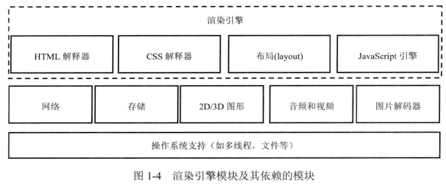

# web_kernel_learning_note
web_kernel_learning_note

web内核学习笔记《webkit技术内幕》

### 第一章 浏览器和浏览器内核

- chromium本身也是一个浏览器，是基于webkit内核演进出来的。chrome是chromium开源的稳定版本。
- 浏览器的功能包括网络、资源管理、网页浏览、多页面管理、插件和扩展、书签管理、历史记录管理、设置管理、下载管理、账户和同步、安全机制、隐私管理、外观主题、开发者工具
- HTML5包含了一系列的标准，包含了10个大的类别：离线（offline）、存储（storage）、连接（connectivity）、文件访问（file access）、语义（semantics）、音频和视频（audio/video)、3D和图形（3D/graphics)、展示（presentation）、性能（performance）和其他
- User Agent用来表明浏览器的身份，可以让web服务器知道当前浏览器的类型，从而为不同的浏览器发送不同的内容，例如Chrome桌面版和Android版发送不同的内容以适应屏幕和操作系统。
- 当某一个浏览器成为主流时（例如chrome），内容服务商会单独给这个浏览器提供额外内容，其他浏览器就会把自己的user Agent修改成chrome的，蹭chrome的额外内容。
- 早期的web内核包括HTML解析器、CSS解释器、布局layout、JavaScript引擎为主的渲染引擎，还包括网络、存储、2D/3D图形、音频和视频、图片解码器等，如下图所示：

- 早期webkit的渲染流程如下图所示

- 后来苹果宣布了WebKit2，目标是抽象出一组新的接口，使调用者代码和网页的渲染代码分成了两个进程。同时接口的使用者不需要理解背后的多进程机制，这时候webkit变成了如下的架构：

  

  ### 第二章  HTML网页和结构

1. 每一个网页都是由HTML、CSS和Javascript组成的，CSS用来将样式和数据分离，Javascript用来处理和用户交互

2. HTML5标准发布以后，浏览器将原生支持多媒体、2D/3D图形，不需要借助第三方插件，这些和其他普通HTML元素一样，可以赋予同样的样式和操作，支持Javascript的各种变换。

3. 对于需要复杂变换和处理的元素，他们需要新层，为了渲染引擎在处理上的方便和高效，这些新层通常以frameset、frame、iframe为框结构。或者是div、video等标签。

4. 浏览器的主要作用是将用户的url转变成可视化图像，其中包含两个过程，一个是网页加载过程，从url到构建dom树，第二是网页渲染过程，从dom树到生成可视化图像

5. 通常网页要比我们的屏幕可视面积要大（要滚动下去），当前可见的区域称为视图（viewport）

6. 根据数据的流向， 渲染过程分为三个阶段：（1）从网页的URL到构建完DOM树（2）从DOM树到构建完webkit的绘图上下文（3）从绘图上下文到生成最终的图像。

   1. 当用户输入网页URL的时候，Webkit调用其资源加载器加载该URL对应的网页

   2. 加载器依赖网络模块建立连接，发送请求并接受答复

   3. webkit接受到各种网页和资源的数据

   4. 收到网页的数据，交给HTML解释器转变成一系列的词法（Token）

   5. 解释器根据词法构建节点（Node），形成DOM树

   6. 如果是JavaScript代码的话，调用JavaScript引擎解释并执行。

   7. JavaScript代码会修改DOM树的结构

   8. 如果节点需要依赖其他资源如图片等，如果是异步的无所谓，如果是同步的，则会阻塞DOM树的构建。

   9. 发出DOMConent事件（在DOM树构建完成以后）和DOM的onload事件（DOM构建完并且所有资源加载完）

   10. CSS文件被CSS解释器解释成内部表示结构

   11. 在DOM树上附加解释后的样式信息，形成RenderObject树

   12. RenderObject节点在创建的同时，WebKit会根据网页层次结构创建RenderLayer树，形成虚拟的render context。

   13. render context会对接到不同平台的实现类（例如skia等）

   14. 绘制页面

       

### 第三章  WebKit架构及模块

1. webkit架构如下，其中虚线框表示该模块在不同浏览器中的实现不同，实线框表示普遍共享的模块。最下面是操作系统例如Windows，Android。在往上是第三方库例如opengl等。在往上是webkit项目，包含webcore、webkit2接口等。WebCore包含HTML解释器、CSS解释器、SVG、DOM、渲染树还有Inspector调试网页。JavaScriptCore是JS引擎，后面会被替换为V8引擎。WebKit Ports指的是WebKit中的非共享部分，根据平台不同而不同。

   

2. webkit的源代码结构如下：

   

   

3. Chromium架构如下，他是基于Webkit做了一些创新,新增了一些模块，blink只是chromium的一部分。GPU/CommandBuffer是硬件加速架构，CC是chromium Compositor，是Chromium自己写的一套合成器。Content模块和Content 接口是对网页渲染内容的抽象，有点像外观模式了。Chromium、Content Shell和Android WebView是三个浏览器，其中Chromium部分代码没有开源。Content Shell是纯开源的用来测试Content模块正确性的项目，Android WebView模块用来替换Android系统自带的webview

   

4. Chromium是多进程架构，主要优势是隔离多个页面的资源，不会出现某个页面或者插件崩溃了以后影响别的页面。同时也方便了安全模型的实施，沙箱模型就是基于多进程架构的。chromium的多进程模型如下：其中**Browser**是浏览器的朱金城，负责各个页面的管理，是其他类型进程的祖先，**Renderer**进程是渲染进程，可能有多个进程。**NPAPI插件进程**是为NPAPI类型的插件而创建的，每种类型的插件都只会被创建一次。**GPU进程**最多只有一个，且只有当GPU硬件加速打开的时候才会被创建，主要用于3D图形加速。**Pepper插件进程**和NPAPI插件进程类似，不过是为了Pepper插件而创建的进程。

   

5. Android平台上，GPU进程退化成GPU线程，Renderer进程会变成Android上的服务（service）进程

6. renderer进程被创建的方式（1）Process-per-site-instance，为每一个页面创建独立的render进程，好处是每个页面互不影响，坏处是资源的巨大浪费（2）process-per-site，属于同一个域的页面共享一个render进程，不同域属于不同的进程。坏处是可能有特别大的renderer进程。（3）process-per-tag，为每一个标签页都创建一个独立的进程（4）single-process，所有渲染工作都在Browser进程中进行。

